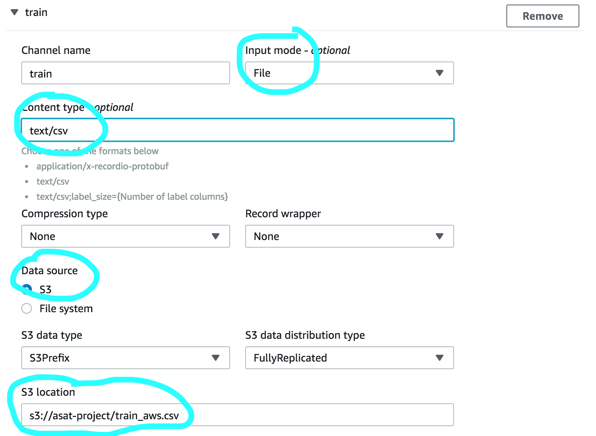

End to End Machine Learning with AWS


[TOC]


Are you looking to push your dataset from development-of-model to deployment?

Let's do it  with help of the following tools / services:

* **S3 (Simple Storage Service)**
 * **Amazon SageMaker**
 * **AWS Lambda**
 * **Amazon API Gateway**
 * **Pricing for AWS Services**


## A. Dataset

For our end to end flow, let's use the following dataset.

**Dataset:** *Airline Passenger Satisfaction* from Kaggle.

**Location:** https://www.kaggle.com/teejmahal20/classification-predicting-customer-satisfaction


The **Objective**  is to **predict customer satisfaction** from the air travel survey data.

### About Data:

* Total Attributes: 25
  * Total ‘int’ attributes: 17
  * Total ‘float’ attributes: 1
  * Total ‘categorical’ attributes: 5
  * Total ‘categorical’ attributes: 5	

Perform Data Cleaning (drop the irrelevant attributes, encode the categorical variables, handle the null values for the attributes).

By understanding data, perfrom feature engineering as well.

### Compatability of Dataset with AWS

The **AWS services** look for **the label as a first column with no headers**.

In our case, the label is - satisfaction.  The valid values are 0 (*dis-satisfied*) or 1 (*satisfied*).

Modify the dataset to remove the headers and make sure to have the *label* as the first column.


## B. Upload Dataset to S3

The **S3** is a Simple Storage Service. In other words, it is a storage space in cloud.

Login to your [AWS account](http://aws.amazon.com). Look for service called S3 ( Simple Storage Service).

* **Create a new S3 bucket**. 

  Note that the bucket name must be unique needs across all exisiting Amazon S3 buckets. 

  Let's **create a new bucket** with name: **asat-project** with appropriate **region**.


* Upload the AWS compatible dataset to S3 bucket.


## C. Launch Amazon SagaMaker

Look for service **SageMaker** and launch.

Amazon SageMaker is a service which helps to **build, train and deploy machine learning models**.

The following are the steps involved:

* **Create Training Job**

* **Create Model**

* **Create End Point Configuration**

* **Create End Point**

  

### Create Training Job

This will build the model using the algorithm specified with the train & test / validation dataset.

When you create a training job, Amazon SageMaker sets up the distributed compute cluster, performs the training, and deletes the cluster when training has completed. The resulting model artifacts are stored in the location you specified when you created the training job. 

Following are the steps involved in creating a training job:

1. Name the Traning Job
2. Attach the IAM Role
   - Create New IAM Role
   - SageMaker needs to access all services. So, attach **AmazonSageMakerFullAccess** to that Role.
3. Choose an Algorithm
4. Resource Configuration.
   - Customize the machine based on your dataset. For now, leave it as default.
5. Hyperparameters
   - Set **feature_dim** to 22 as per our dataset. Don't count Label column.
   - Set **predictor_type** to **binary_classifier**
6. Create **train** channel
   - **Input mode: File**.
   - **Content type: text/csv**.
   - **Datasource : S3**
   - S3 location: **s3://asat-project/train_aws.csv**
7. Add channel for  **test**.
   - **Input mode: File**.
   - **Content type: text/csv**.
   - **Datasource : S3**
   - S3 location: **s3://asat-project/test_aws.csv**
8. Ignore Check Point.
9. Set S3 Ouput path.
10. Click - Create Training Job

- Launch SageMaker


* **Create Training Job**

  * 

  * Name the training job

    

  * Create new IAM Role

    

  * Attach IAM role

    

  * Choose an algorithm

    

  * Resource Configuration

    

  * Hyperparameters

  * Create **train** channel

    

  * Create **test** channel

    

  * Ignore Check point

  * Set Output Path

    

  * Click - **Create Training Job**.

    

### Create Model

Prepare the model to deploy, which refers to the model artifacts generated during the training time.

* Click on the completed training job.

  

* Name the model

  

* Verify the location of the model artifacts, which was generated during the model training time.

  

* Click - **Create Model**

  


### Create End Point Configuration

The Amazon SageMaker uses End Point Configuration to refer to the  **model and the resources required to deploy the model**.

* Select Model and Create End Point Configuration

  

* Name the end point configuration

  

* Create endpoint configuration

  

### Create End Point

The  Amazon SageMaker End Point is the **service which interacts with other services**.

To create an end point, you should specify the existing end point configuration or create a new end point configuration.

**NOTE: <u>There is a cost associated with this service. You may need to delete the service when not required</u>.**

* In Amazon SageMaker, click on Endpoints.

  

  

  

  

* Name the endpoint

  

* Use an existing endpoint configuration

  

* Create endpoint

  


## AWS Lambda

AWS Lambda is a service, which allows you to execute code for any type of application. 

**AWS Lambda can be used to run code in response to certain events from other services**.

AWS Lambda supports the following languages: **Python, Node.js, Java, C#, Go**.


The following steps are involved in creating the Lambda function:

* Create a **IAM role** which can access **Amazon SageMaker (AmazonSageMakerFullAccess)** end points.
* Create Lambda function.
* Test Lambda function


### Create a new IAM Role to access Amazon SageMaker

* Launch IAM and Create Role

  

  

  

  

* Create Role

  


### Create Lambda Function

* Launch Lambda and Create Lambda function

  

  


* Create Lambda function

  

   

  

* Change Default Code with the below code.

  ```python
  import os
  import boto3 # AWS SDK for python
  import json
  
  
  # grab environment variables
  ENDPOINT_NAME = os.environ['ENDPOINT_NAME']
  runtime = boto3.client('runtime.sagemaker')
  
  def lambda_handler(event, context):
      payload = event['data']
      print('Payload: {}'.format(payload))
  
      response = runtime.invoke_endpoint(EndpointName=ENDPOINT_NAME,
                                         ContentType='text/csv',
                                         Body=payload)
      print(response)
      result = response['Body'].read().decode()
      print('result: ',result[0])
     
      predicted_value = float(result)
      if(predicted_value < 0.5 ):
          return 0 # dis-satisfied
      else:
          return 1 # satisfied
  ```

  

* Update default code and set endpoint name

  

* Test Lambda

  * Configure Test Event - Create new test

    

  * Create new test event

    

  * Results

    

    

## Amazon API Gateway (Content Delivery Network)

Amazon API Gateway enables to create and deploy our own RESTful APIs ( HTTP requests to GET, PUT, POST  and DELETE data - the most suitable for efficient internet usage).

Following steps are involved in deploying a RESTful API.

* Create REST API
* Deploy REST API
* Verify / Test REST API


### Create REST API

* Launch Amazon API Gateway

* Create REST API

  

  

  

  

* Create Resource

  

  

* Create Method -  POST

  

  

  

  

   

* Deploy API 

  

  

  

* Invokation URL

  

  

  

  ## Verify Using Postman

  

* Launch Postman and invoke URL.

  

 


 